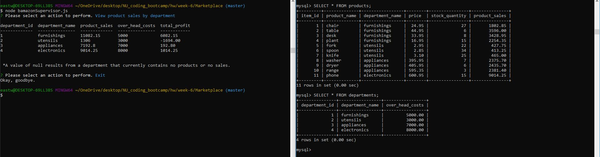

# Marketplace

### About
- The Marketplace application uses a MySQL database to allow customers, managers, and supervisors to perform different interactions with a virtual marketplace.
- Customers can place orders for the items in the database.
- Managers can check the inventory of the store, restock the store, and add new products to the store.
- Supervisors can check department sales and add new departments.

### Getting Started
1. Users must first download the files and install the npms in the package.json file.
2. After that, using the app is as simple as using node to invoke the program in the terminal.

### Screenshots

